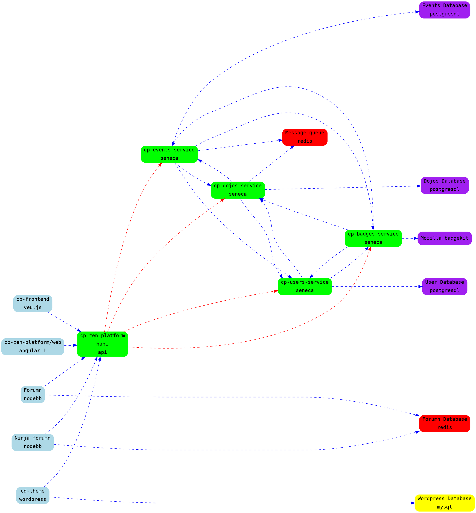

# Networking

## CoderDojo System Architecture




## Public Facing

cp-zen-platform is the only service that should be public facing.

When setting a service to be public facing we want to make a load balancer for it this is done by
running `kubectl edit service service-name`. You'll need to edit the service file  and add the
following configs

``` yaml
metadata:
  annotations:
    service.beta.kubernetes.io/aws-load-balancer-backend-protocol: http
    service.beta.kubernetes.io/aws-load-balancer-ssl-cert: arn:aws:acm:eu-west-1:116766832461:certificate/3cf7c463-72cd-4323-8702-a1e7a0b93428  # This Cert name may be different for you if the cert is changed or replaced
spec:
  ports:
  - name: https
    port: 443
    protocol: TCP
    targetPort: $PORT_OF_SERVICE
  - name: http
    port: 80
    protocol: TCP
    targetPort: $PORT_OF_SERVICE
  type: LoadBalancer
```

k8 will then create a elb for the service. This eld will expose the ports specified, and send them
to ports on the node that k8 will choose which will then be sent to the specified port on the
container. The elb will provide ssl for all connections. Youll need to have the service redirect to
https it self, on zen this is done by setting the env PROTOCOL to https.

Once the elb is created go to route 53 and create the domain you want, set it as an alias for the
elb you've just created.
